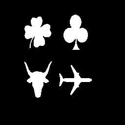
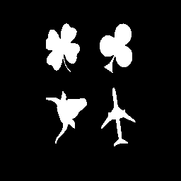

# homotopic-skeletonization-and-shape-analysis
## 1 Homotopic skeletonization
Homotopic skeletonization is applied to obtain the skeleton of the two images shown below, namely "penn256" and "bear". The final superposition of the skeleton with the original images are as shown in the "ouptut_penn256" and "output_bear" images. 

## 2 Shape Analysis 
Minimum bounding box approach is used in order to bound each individual objects in the two "match1" and "match3" images. The size distribution, pecstrum and complexity of each object is computed. Using pecstral analysis, the best object match from "match3" with respect to match1 is computed. 

Similar shape analysis is done for the "Peanuts" comic strip where the best match is computed. 

# Readme.txt 

-main_skele.m for homotopic skeletonization

-main_shape2a.m for shape analyis of match1.gif and match3.gif

-main_shape2b.m for shape analysis of shadow1.gif and shadow1rotated.gif

Keep MATLAB working command on the same working directory as this project files
All images will be saved in the current working directory

